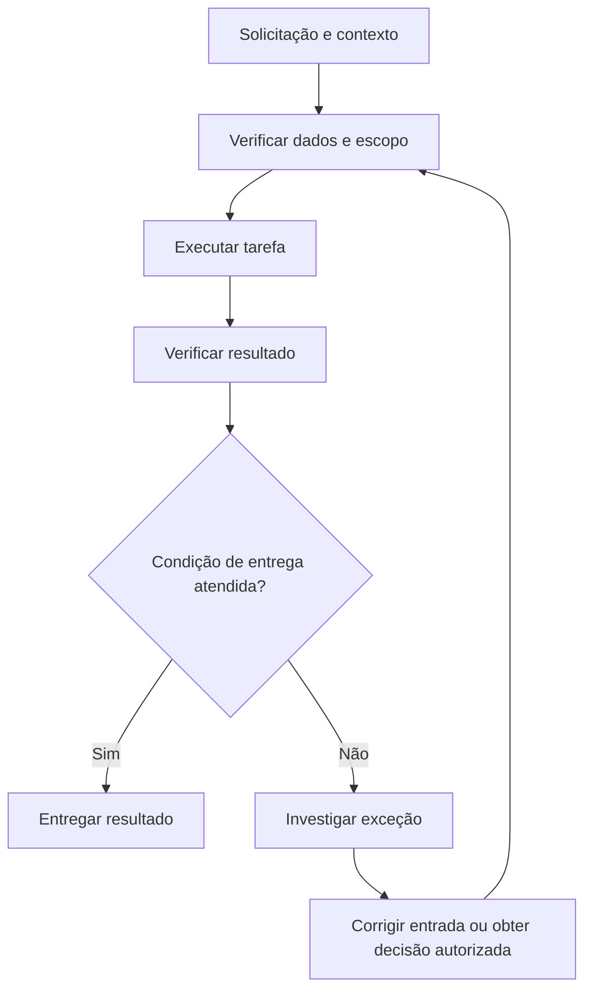
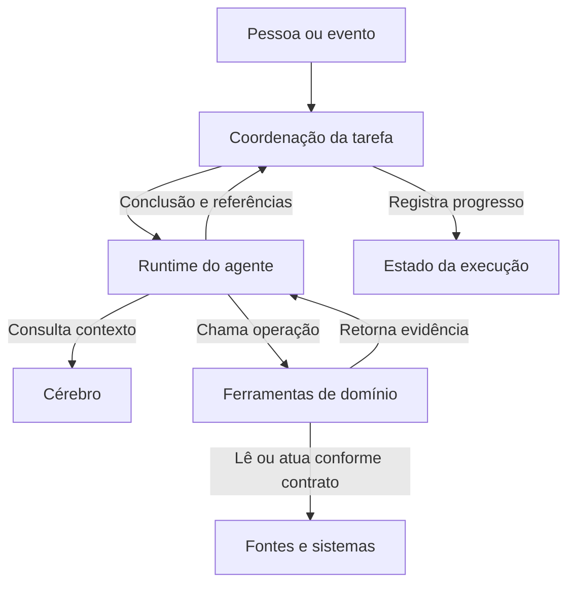
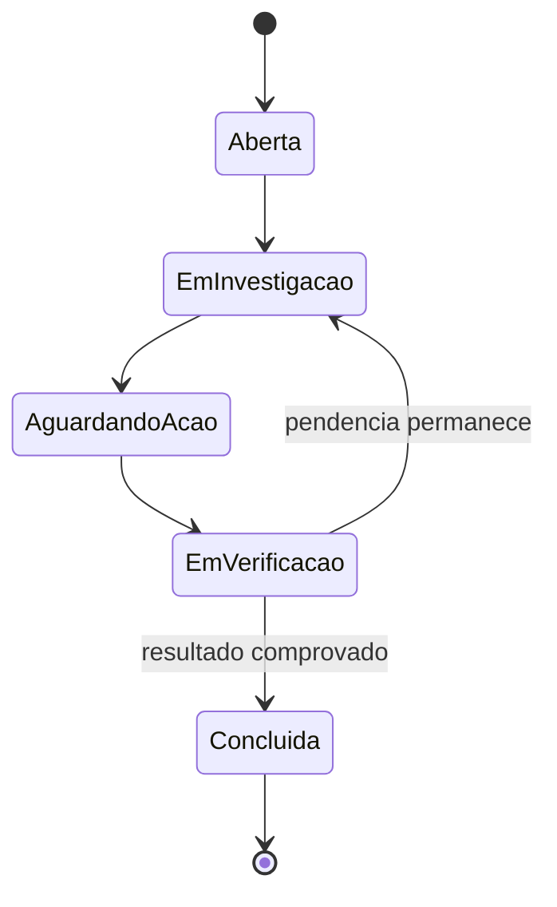

# Roteiro para um documento de arquitetura

Use ao criar um documento completo ou reorganizar uma arquitetura. As seções abaixo são responsabilidades a cobrir; combine ou omita as que não se aplicam. Preserve o padrão de começar pelo Cérebro após uma abertura breve. Não copie exemplos como decisões do projeto.

## Abertura

Declare o objetivo, usuário e entrega em um parágrafo. Identifique se descreve o sistema atual ou uma proposta. Registre restrições determinantes e o que foi examinado; não afirme que há implementação ou validação apenas porque há documentação.

## Cérebro: conhecimento e contrato de atuação

Explique o que é conhecimento compartilhado e o que é específico da rotina do agente. Uma árvore possível, a adaptar:

```text
contexto/
├── dominios/<dominio>/
│   ├── indice.md          temas, resumos e referências
│   ├── vocabulario.md     conceitos e ambiguidades
│   ├── fontes.md          origem oficial de fatos
│   ├── processos/         trabalho e contratos de entrega
│   ├── politicas/         critérios e referência à versão executável
│   └── casos/             exemplos validados e contraexemplos
└── agentes/<mandato>/
    ├── agente.md          gatilho, objetivo e ordem de leitura
    ├── autoridade.md      ações permitidas e decisões externas
    ├── ferramentas.md    catálogo e limites
    ├── workflows/        navegação e procedimento por tarefa
    └── avaliacao/        critérios e casos do mandato
```

Para nós relevantes, descreva assunto, dono, atualização, fonte e relações. Explique como o índice conduz à regra e à evidência necessária. Estado vivo de execução reside no mecanismo operacional escolhido, mesmo que haja resumos no contexto.

## Produto e fluxo de trabalho

Registre as respostas que justificam as capacidades. Uma tabela curta pode conectar pergunta, resposta/evidência, decisão e pendência. Explique o resultado removendo o vocabulário da stack: o usuário precisa conseguir dizer o que ganhou.

Para cada etapa importante, descreva:

| Entrada | Trabalho | Saída e consumidor | Condição de avanço |
|---|---|---|---|
| Dados/contexto disponíveis naquele instante | Ação verificável, investigação ou decisão | Artefato/estado utilizado depois | Evidência e responsável quando necessário |

Este exemplo ilustra uma tarefa com revisão; remova a aprovação se o domínio não a exigir:



Descreva o significado da condição e a evidência de atendimento. Se o resultado puder ser provisório, defina quem pode consumi-lo e o que impede sua promoção a definitivo. Ausência de dado não equivale a condição satisfeita.

## Arquitetura e contratos

Explique como as responsabilidades do fluxo se tornam componentes. Uma tabela componente → motivo → contrato → tecnologia proposta ajuda mais que uma enumeração de marcas.

O diagrama deve refletir a stack real/proposta. Este exemplo apresenta apenas responsabilidades e distingue chamada, leitura e coordenação:



Só use coordenador e estado separado se a execução os exigir. Um runtime curto pode assumir a coordenação; uma rotina determinística pode funcionar sem agente. Um serviço não deve existir apenas para preencher uma caixa.

Descreva dados e ferramentas com a precisão necessária à construção:

- Entidades, identidade, granularidade e relações. Quando há várias linhas por entidade, explique como evita dupla contagem ou ações duplicadas.
- Operações com entrada, saída, erros, efeito externo e limite de acesso. Escolha nomes do domínio, não funções genéricas de SQL livre sem motivo.
- Referências que sustentam a conclusão: documento, consulta, recurso ou versão, conforme o caso.
- Comportamento diante de ausência, conflito, atraso ou mudança de dados.

Schemas e exemplos de código são úteis para contratos ambíguos. Não preencha o documento com DDL que não foi validado ou que contradiga o nível de decisão atual.

## Navegação, estado e autoridade

Explique o que a pessoa vê e o que o agente carrega em cada passo. Exemplo: situação geral → grupo afetado → entidade → documento → ação. Apresente mecanismos de busca/expansão com referências e critérios; “carregar o contexto relevante” sozinho não é desenho executável.

Se a tarefa atravessa tempo, atores ou tentativas, descreva estado persistido, identidade e retomada. Estados de exceção podem ser mostrados em Mermaid:



Adapte o ciclo; não confunda uma hipótese explicada com ação executada. Declare quando mudança de versão invalida uma conclusão ou autorização. Para ação externa repetível, defina chave de idempotência ou mecanismo equivalente quando necessário.

Mapeie ações para identidades: agente, job, pessoa e serviço. Diferencie permissão de alcançar um serviço da validação de campos/escopo dentro dele. Só inclua aprovações exigidas pelo domínio ou pelas restrições conhecidas; não crie uma cerimônia universal.

## Avaliação e construção

Escolha casos que podem contrariar o desenho: um sucesso, uma ausência/confusão plausível e, quando aplicável, mudança de versão ou retomada. Estabeleça a origem da resposta esperada. Comparar apenas com o sistema anterior pode reproduzir um erro compartilhado.

Separe qualidade da tarefa (resultado correto), qualidade do agente (raciocínio sustentado, ferramenta e ação adequadas) e efeito no produto (prazo, custo ou trabalho resolvido). Não invente metas; registre o que será medido e quem define o critério.

O roadmap entrega capacidades utilizáveis, com dependências e critérios observáveis. Não reserve toda a interface, evidência ou gestão de exceções para o final quando já forem necessárias à primeira entrega. A habilitação de autonomia deve acompanhar autoridade e evidência, não apenas disponibilidade técnica.

## Revisão editorial do conjunto

Use prosa para explicar causa e consequência, tabelas para comparação/contratos e Mermaid para fluxo, componentes ou estados. Antes de cada diagrama diga a pergunta que ele responde; depois esclareça a decisão mais importante. Evite diagramas gigantes que misturam navegação de conhecimento, rede, processo e aprovação na mesma escala.

Ao atualizar uma arquitetura, revise as seções afetadas em vez de acumular adendos. Mantenha descrições, nomes, setas, assinaturas e roadmap compatíveis. Cite documentação primária para capacidades técnicas verificadas e marque escolhas do projeto como escolhas, não como mandamentos de uma fonte externa.
